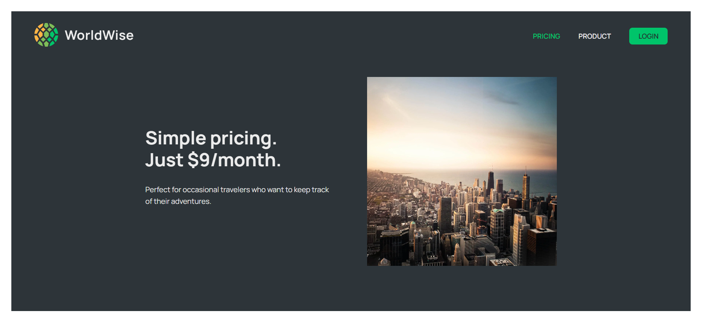
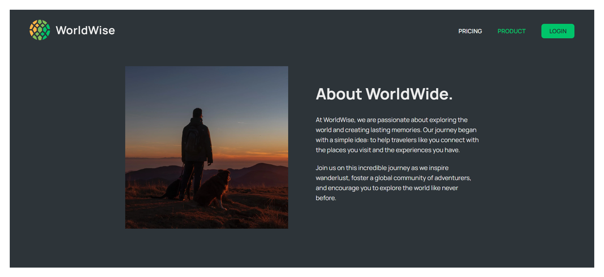
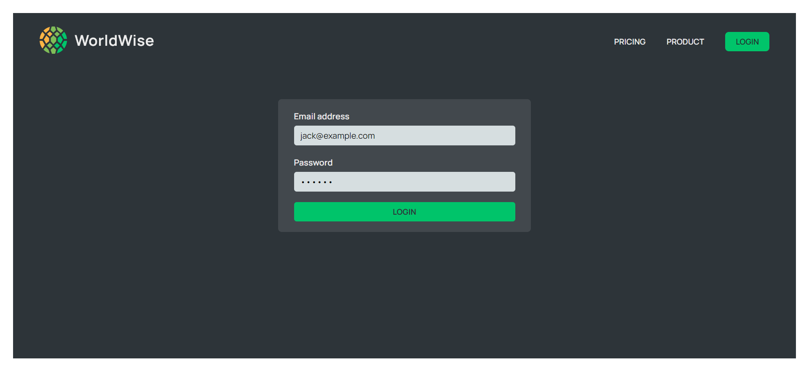
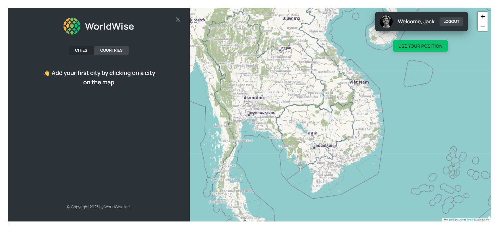
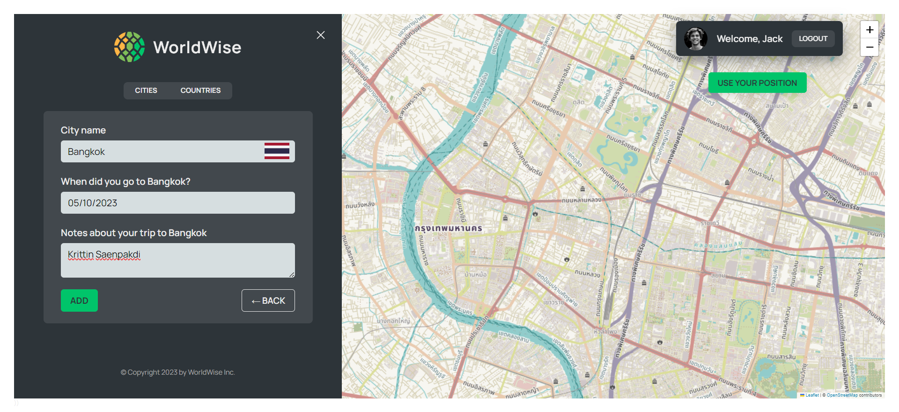

# WorldWise - A React app to helps you track your travels and create a visual record of your adventures.

This project is a part of [The Ultimate React Course 2023: React, Redux & More](https://www.udemy.com/course/the-ultimate-react-course/) by [Jonas Schmedtmann](https://github.com/jonasschmedtmann). The website's design and structure were provided as part of the course curriculum, and I did not design the website from scratch. The primary purpose of this project is to practice and apply the concepts learned during the course.

## Live Demo

Check out the live demo of the project [here](https://worldwise-krittin-saenpakdi.netlify.app/).

## Description

WorldWise helps you track your travels and create a visual record of your adventures. It allows you to add cities to your list and view them on a world map, as well as view information about each city.

It is built using [React.js](https://react.dev/), [React Router](https://reactrouter.com/), [React DatePicker](https://reactdatepicker.com/), [React Leaflet](https://react-leaflet.js.org/), and [BigDataCloud Client Side Reverse Geocoding to City API](https://www.bigdatacloud.com/free-api/free-reverse-geocode-to-city-api).

This application is currently in development, but it is already a useful tool for travelers. It is easy to use and has a clean and modern user interface. I am also actively working on a responsive design for mobile users.

Stay tuned for updates!

**Features**

* **Pages:** WorldWise has 5 pages: homepage, pricing, product, login, and app.
* **Interactive world map:** WorldWise displays a world map with markers for all of the cities that the user has added to their list.
* **City list:** WorldWise displays a list of all of the cities that the user has added to their list. The list includes the city name, country flag, and date of visit.
* **City form:** When the user clicks on a city on the map or in the list, WorldWise displays a form with information about the city, including the city name, country flag, date of visit, and notes about the trip.
* **Add city:** The user can add a city to their list by filling out the city form and clicking the "Add" button. A marker will then appear on the map for the new city.
* **Remove city:** The user can remove a city from their list by clicking the "&times;" button next to the city in the list. The marker for the city will then be removed from the map.
* **Current user geolocation:** The user can click the "USE YOUR POSITION" button to navigate the map to their current user's geolocation.
* **Local storage:** The list of cities is persisted in local storage, so that the user's list is preserved even if they close the browser or navigate to a different page.
* **Login and logout functionality:** WorldWise allows users to log in and out of their accounts.
* **Tab component:** WorldWise has a tab component that displays a list of cities and correspond countries that user added. This allows users to quickly switch between different views of their list.

## Screenshots













## Getting Started

To get started with worldwise, you will need to have Node.js and Vite installed on your machine.

To install Node.js, visit the Node.js website: https://nodejs.org/en.

To install Vite, run the following command in your terminal:

```
npm install -g vite
```

Once you have Node.js and Vite installed, you can clone the worldwise repository to your local machine:

```
git clone https://github.com/SuperUser-Gump/worldwise.git
```

Navigate to the worldwise directory and install the dependencies:

```
cd worldwise
npm install
```

To start the development server, run the following command:

```
npm run dev
```

The development server will be running on http://localhost:5173. You can open this URL in your web browser to view the worldwise app.


## Usage

WorldWise is a web application that helps you track your travels and create a visual record of your adventures. To use WorldWise, simply log in and start adding cities to your list.

**To add a city to your list:**

* Click on the position on the map where you want to add a city.
* The city form will be displayed automatically.
* You can fill out the city form, including the city name, country flag, date of visit, and notes about your trip. Alternatively, you can click on the "Add City" button without filling out the form to simply add a marker to the map.
* Click the "Add" button.

A marker will then appear on the map for the new city.

**To remove a city from your list:**

* Click on the "&times;" button next to the city in the list.
* The marker for the city will then be removed from the map.

**To view information about a city:**

* Click on the city name in the list or on the map.
* A form will be displayed with information about the city, including the city name, country flag, date of visit, and notes about your trip.

**To navigate the map to a city:**

* Click on the city name in the list or on the map.
* The map will navigate to the corresponding position. You can also zoom and pan the map to navigate to a city.

**To use the tab component:**

* Click on the tab that you want to view.
* The corresponding view will be displayed.

**To use the login and logout functionality:**

* To log in, click on the "LOGIN" button and enter your email address and password.
* To log out, click on the "LOGOUT" button.

## Acknowledgments

This project was created as part of [The Ultimate React Course 2023: React, Redux & More](https://www.udemy.com/course/the-ultimate-react-course/) by [Jonas Schmedtmann](https://github.com/jonasschmedtmann). Special thanks to him for providing the project structure and design.
